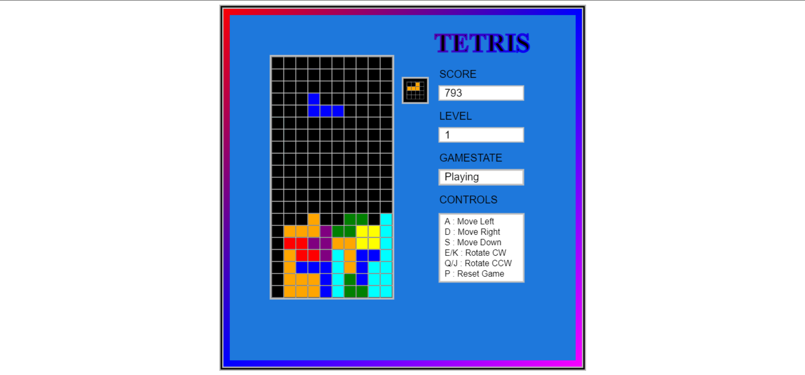
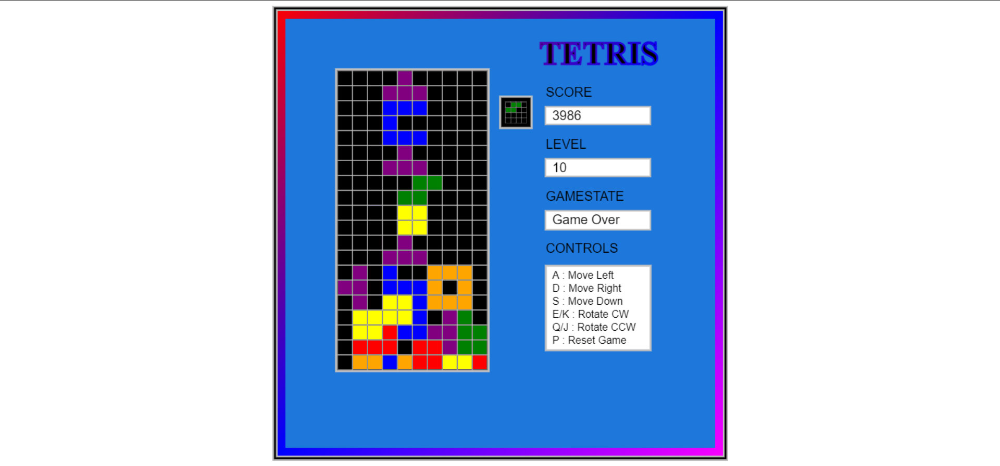

# Tetris

Implemented with vanilla javascript + css/html

### Execution
The file 'tetris.html' will open the game in your browser.

### Controls
- A: Move Left
- D: Move Right
- S: Move Down
- E/K: Rotate Clockwise
- Q/J: Rotate Counterclockwise
- P: Reset All Game States

### Screenshots

